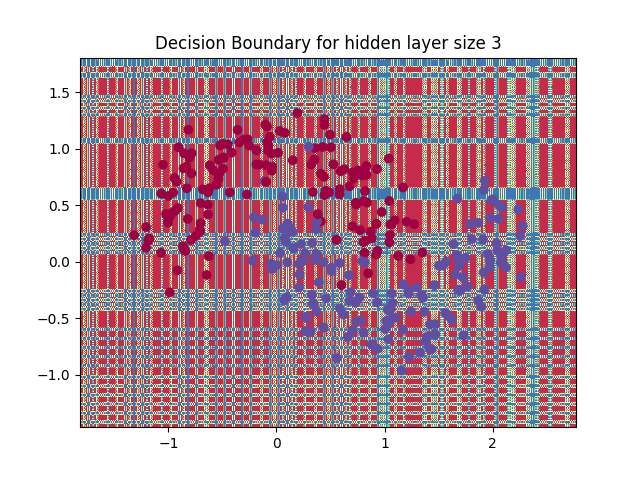
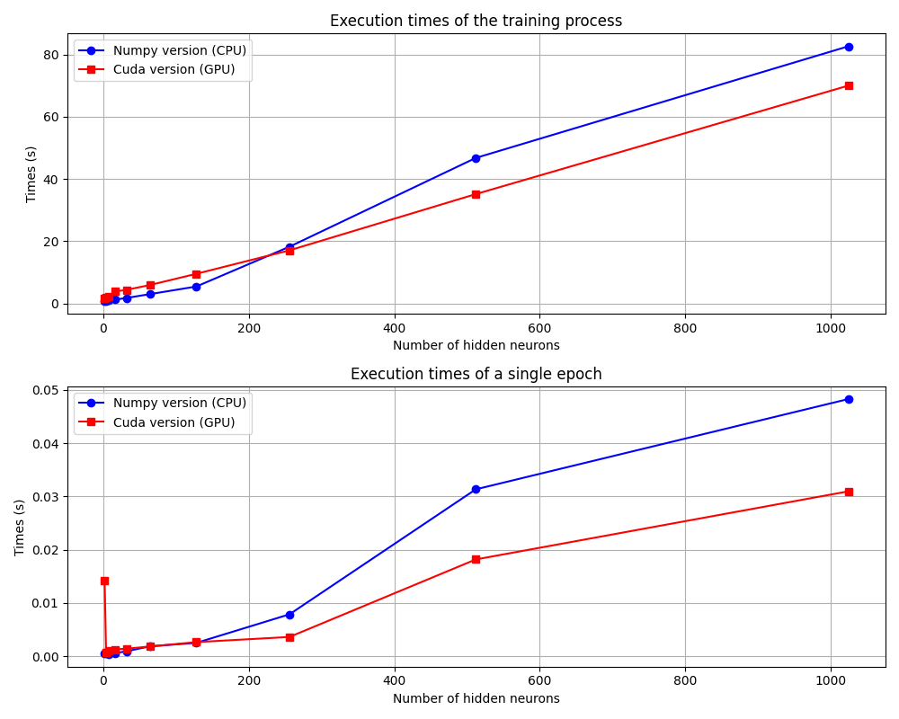

# GP-GPU Computing project
### Djoser SIMEU M2 MOSIG 
In the context of the GP-GPU computing project, I have as project to parallelize at GPU levels the computation of a MLP model for the trainning and the inference process.
# Architecture of the project 
The project is in python programming language with the usage of the pyCuda python library a NVIDIA Gpu Computing framework. I divided this project into two main part : The paralellization of an MLP model with one hidden layer, and the paralellization of an MLP model with $n$ hidden layer where $n$ is a parameters of the model. For both paralellization problems, I defined multiple parallelization levels where the levels 0 correspond to a sequential execution on CPU, their are modelized by the files ```main_lvlN.py```.
# First Step : Matrix Computation parallelization
The first objective is to only parallelize the matrix operation made on the program: 

``` python
######################### FIRST PARALIZATION STEP #########################""
# dot product between two vectors
def dot_product(v1, v2):
    acc=0
    for v_1,v_2 in zip(v1,v2):
        acc+=v_1*v_2
    return acc

# Add two vectors
def add_bias(v1, v2):
    res=[]
    for v_1, v_2 in zip(v1,v2):
        res.append(v_1+v_2) 
    return res
# Get the columns number "index" of W
def get_columns(W, index):
    res=[]
    for row in W:
        res.append(row[index])
    return res

# Transpose a matrix
def transpose(W):
    res=[]
    for i in range(len(W[0])):
        res.append(get_columns(W,i))
    return res

# Multiplication between two matrices()
def matrix_multiplication(X, W):
    res=[]
    for row_x in X:
        tmp=[]
        for i in range(len(W[0])):
            tmp.append(dot_product(row_x,get_columns(W,i))) #Dot product between each row of the matrix X and each line of the matrix W
        res.append(tmp)

    return res

```
## dot product :
I paralelized the dot product computation by using a cuda kernel inspired from the reduction method.

``` cuda
extern "C" __global__ void dot_product(float *v1, float *v2, float *o, int n) {
    extern __shared__ float sdata[];
    unsigned int tid = threadIdx.x;
    unsigned int i = blockIdx.x * blockDim.x + threadIdx.x;
    sdata[tid]=0;
    __syncthreads();    
    if (i < n) {
        sdata[tid] = v1[i] * v2[i];
    }
    __syncthreads();
    for (unsigned int s = blockDim.x / 2; s > 0; s >>= 1) {
        if (tid < s) {
            sdata[tid] += sdata[tid + s];
        }
        __syncthreads();
    }
    if (tid == 0) {
        o[blockIdx.x] = sdata[0];
    }
}
```
## matrix multiplication
I find a kernel code for tiled matrix multiplication with random size <href>https://stackoverflow.com/questions/18815489/cuda-tiled-matrix-matrix-multiplication-with-shared-memory-and-matrix-size-whic</href> :

``` cuda
extern "C" __global__ void MatMul(float* A, float* B, float* C, int ARows, int ACols, int BRows,
    int BCols, int CRows, int CCols)
{
    float CValue = 0;

    int Row = blockIdx.y*TILE_DIM + threadIdx.y;
    int Col = blockIdx.x*TILE_DIM + threadIdx.x;

    __shared__ float As[TILE_DIM][TILE_DIM];
    __shared__ float Bs[TILE_DIM][TILE_DIM];

    for (int k = 0; k < (TILE_DIM + ACols - 1)/TILE_DIM; k++) {

         if (k*TILE_DIM + threadIdx.x < ACols && Row < ARows)
             As[threadIdx.y][threadIdx.x] = A[Row*ACols + k*TILE_DIM + threadIdx.x];
         else
             As[threadIdx.y][threadIdx.x] = 0.0;

         if (k*TILE_DIM + threadIdx.y < BRows && Col < BCols)
             Bs[threadIdx.y][threadIdx.x] = B[(k*TILE_DIM + threadIdx.y)*BCols + Col];
         else
             Bs[threadIdx.y][threadIdx.x] = 0.0;

         __syncthreads();

         for (int n = 0; n < TILE_DIM; ++n)
             CValue += As[threadIdx.y][n] * Bs[n][threadIdx.x];

         __syncthreads();
    }

    if (Row < CRows && Col < CCols)
        C[((blockIdx.y * blockDim.y + threadIdx.y)*CCols) +
           (blockIdx.x * blockDim.x)+ threadIdx.x] = CValue;
}
```
### Memory managment 
To implement this gpu parallelization for matrices operation in an efficient way, I must pay attention to the memory managment of my model, for instance, if at each time I want to computa a matrix operation on gpu i need to pay the communication cost of moving my data from the cpu to the gpu, it will not bee efficient. It that context I must think at which data would stay on gpu:
+ The weigths W1,W2,B1,B2
+ The datapoints "X"?
And also I must think about which functions would be computed on gpu or cpu : 
+ Initialisation of the weights : cpu
+ matrix operation : gpu
+ activation function : gpu
+ gradient descent : gpu
+ forward function : gpu
+ accuracy computation :cpu
* NOTEBOOK
# Thursday 12 december
The goal is to modify the trainning function to stabilyze the learning. Actually the $plot_decision_boundary$ plot a quasi-random decision frontie after 1000 epochs:


``` shell
Loss at epoch 996: 14.352945
Loss at epoch 997: 14.350966
Loss at epoch 998: 14.348990
Loss at epoch 999: 14.347015
The final accuracy obtained is : 0.5
```

## Kernel level unitary tests
In previous sessions, I tests the succession Cuda kernels functions of the global trainning function ```train_model``` until the update of the parameters of the model. I test the results of the GPU kernels by comparing their results with the ones obtain by following the code of the trainning function of the numlpy version of the code in the ```MLP``` file.Here we have the code to test the ```update_weights``` kernel for the computation of the update of the weights between the inputs and the hidden layer:

``` python
update_weights(W1, dW1_gpu, new_W1, np.float32(epsilon), np.int32(K1), np.int32(M),
                        block=(TILE_DIM, 1, 1), 
                        grid=((M + TILE_DIM - 1) // TILE_DIM, 1))

new_W1_h=np.zeros_like(model["W1_np"])
drv.memcpy_dtoh(new_W1_h,new_W1)
print("Result update_weights :")
print(new_W1_h)
print("Diff with previous")
print(new_W1_h-model["W1_np"])
new_W1_cpu=model["W1_np"]-epsilon*dW1_cpu
print("Diff with expected :")
print(new_W1_cpu-new_W1_h)
```
And here we have the results of this test:

``` shell
Result update_weights :
[[ 0.33000475 -0.47950882 -0.4184031  -0.29940444 -0.4143973   0.00480782
  -0.03123364 -0.15603122 -0.0085421   0.41625935  0.5108493   0.09920254
   0.2299091  -0.4439389  -0.39621022  0.00283959 -0.31804097  0.34292245
   0.02414407 -0.0672569   0.40444353 -0.12894303  0.19124515 -0.24538928
  -0.39793628 -0.11630772 -0.05905307 -0.4865129   0.3345102  -0.2762262
  -0.34296715  0.2374873 ]
 [-0.31329003 -0.09615654  0.09503268 -0.04258019 -0.41477054  0.4193387
   0.43166313  0.30550686 -0.19578311  0.05409471 -0.21222883  0.08702808
   0.5390163  -0.19353321  0.1588206  -0.18281867  0.3264101  -0.14595002
   0.37945005  0.28425345  0.25978363 -0.00744505 -0.23442174 -0.4588402
  -0.12606387 -0.48036143  0.22629768  0.23753358 -0.12182336  0.24418733
   0.01571197 -0.41482142]]
Diff with previous
[[ 0.17065981 -0.05042723 -0.07100707  0.18401968 -0.02819365 -0.14698145
   0.06610951  0.02294247 -0.0664541  -0.07720113  0.17636278 -0.10042065
  -0.18834947  0.01633239  0.03345633  0.0288333  -0.16720837 -0.09432963
   0.03457911 -0.10690601  0.00918317 -0.07557807 -0.18578924  0.00102897
  -0.17174599  0.05533089 -0.10661735 -0.20664158  0.16308104  0.08098054
   0.06293258 -0.13270445]
 [-0.05015874  0.01783945  0.02349059 -0.06838216  0.00920558  0.04521278
  -0.01947248 -0.00700045  0.02041505  0.02624791 -0.05164556  0.03236077
   0.06461284 -0.00523613 -0.009976   -0.00878587  0.05193284  0.02824001
  -0.01037729  0.03254572 -0.00284848  0.02307592  0.05481376 -0.00031528
   0.05210733 -0.01747409  0.03244227  0.06718355 -0.05229515 -0.02360165
  -0.02029653  0.04531866]]
Diff with expected :
[[ 0.0000000e+00  0.0000000e+00  0.0000000e+00  0.0000000e+00
   0.0000000e+00  7.4505806e-09  0.0000000e+00  0.0000000e+00
  -3.7252903e-09  0.0000000e+00  0.0000000e+00  0.0000000e+00
   0.0000000e+00  0.0000000e+00  0.0000000e+00  4.6566129e-10
   0.0000000e+00  0.0000000e+00  1.8626451e-09  0.0000000e+00
   0.0000000e+00  0.0000000e+00  0.0000000e+00  0.0000000e+00
   0.0000000e+00  0.0000000e+00 -3.7252903e-09  0.0000000e+00
   0.0000000e+00  0.0000000e+00  0.0000000e+00  0.0000000e+00]
 [ 0.0000000e+00  0.0000000e+00  0.0000000e+00  0.0000000e+00
   0.0000000e+00  0.0000000e+00  0.0000000e+00  0.0000000e+00
   0.0000000e+00  3.7252903e-09  0.0000000e+00  0.0000000e+00
   0.0000000e+00  0.0000000e+00  0.0000000e+00  0.0000000e+00
   0.0000000e+00  0.0000000e+00  0.0000000e+00  0.0000000e+00
   0.0000000e+00  4.6566129e-10  0.0000000e+00  0.0000000e+00
   0.0000000e+00  0.0000000e+00  0.0000000e+00  0.0000000e+00
   0.0000000e+00  0.0000000e+00  0.0000000e+00  0.0000000e+00]]

```
We can see that we don't have a big difference between the result and the expected one.
# Wednesday 8 january
## Perfoormance comparison between Numpy VS Cuda implementation

As we can see on the graph, by comparing 
# Sunday 9 february
## Report Structure
### Abstract 
Overview about the goal of the project + briefly present the results observed (write that in last)
### Introduction
Presenting the crux of the problem (why do we need to parallelize MLP) and explain the structure of the report.
### Design Methodology
Present the methodology of the project
#### Mathematical foundations of MLP
Present the mathematical background of MLP such that :
+ MLP architecture
  + Activation function (sigmoid, softmax)
  + Forward pass
+ Supervised learning for classification
 + Datset (X,Y) 
 + Loss function (cross entropy)
+ Gradient descent algorithm
+ Back-Propagation
#### Cuda kernel implementation
prensent all the cuda kernel defined to implement the MLP training process with GPU parallelization (illustrate with scheme)
#### Evaluation of the model 
Explain the model is train on the dataset two moon 
### Results/Analysis
#### Hardware/software used
Present the hardware (GPU-CPU)/ Software(pyCuda/Numpy) used to perform the performance analysis
#### Comparison GPU/CPU
compare the results observed by comparing the performance between gpu an cpu (runtime), explain why it is complicate to perform a strong scaling because of the fixed size of the problem.
#### Roofline model
Present the roofline model of all the kernel defined in our problem : compute the computational intensity (Nb_FLOP/load-store opération), mesure the time needed for the computation of th kernel , draw the roofline by consulting the hardware spécifications (peak processing throughput, the bandwidth) 
## Conclusion and discussion
Present the limitation of the project:
+ Don't take into account optimization method such that SGD
+ Don't consider Weight decay regularization method
+ the usage of pycuda can introduce some cost in the comunication
+ The approach was applied only on the make_two_moon dataset.
Present futher improvement.
